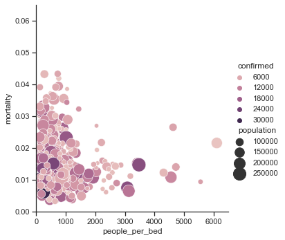

```python
import requests
import pandas as pd
import json
import numpy as np

req=requests.get("https://www.communitybenefitinsight.org/api/get_hospitals.php").json()
hospitals=pd.DataFrame(req)
hospitals.head()


```


<div>
<style scoped>
    .dataframe tbody tr th:only-of-type {
        vertical-align: middle;
    }

    .dataframe tbody tr th {
        vertical-align: top;
    }

    .dataframe thead th {
        text-align: right;
    }
</style>
<table border="1" class="dataframe">
  <thead>
    <tr style="text-align: right;">
      <th></th>
      <th>hospital_id</th>
      <th>hospital_org_id</th>
      <th>ein</th>
      <th>name</th>
      <th>name_cr</th>
      <th>street_address</th>
      <th>city</th>
      <th>state</th>
      <th>zip_code</th>
      <th>fips_state_and_county_code</th>
      <th>hospital_bed_count</th>
      <th>chrch_affl_f</th>
      <th>urban_location_f</th>
      <th>children_hospital_f</th>
      <th>memb_counc_teach_hosps_f</th>
      <th>medicare_provider_number</th>
      <th>county</th>
      <th>hospital_bed_size</th>
      <th>updated_dt</th>
    </tr>
  </thead>
  <tbody>
    <tr>
      <th>0</th>
      <td>1</td>
      <td>1</td>
      <td>630307951</td>
      <td>Mizell Memorial Hospital</td>
      <td>Mizell Memorial Hospital</td>
      <td>702 Main Street</td>
      <td>Opp</td>
      <td>AL</td>
      <td>36462</td>
      <td>01039</td>
      <td>99</td>
      <td>N</td>
      <td>N</td>
      <td>N</td>
      <td>N</td>
      <td>010007</td>
      <td>Covington County</td>
      <td>&lt;100 beds</td>
      <td>June 15, 2022</td>
    </tr>
    <tr>
      <th>1</th>
      <td>2</td>
      <td>2</td>
      <td>630578923</td>
      <td>St Vincents East</td>
      <td>St Vincents East</td>
      <td>50 Medical Park Drive East</td>
      <td>Birmingham</td>
      <td>AL</td>
      <td>35235</td>
      <td>01073</td>
      <td>362</td>
      <td>N</td>
      <td>Y</td>
      <td>N</td>
      <td>Y</td>
      <td>010011</td>
      <td>Jefferson County</td>
      <td>&gt;299 beds</td>
      <td>June 15, 2022</td>
    </tr>
    <tr>
      <th>2</th>
      <td>3</td>
      <td>3</td>
      <td>630312913</td>
      <td>Shelby Baptist Medical Center</td>
      <td>Shelby Baptist Medical Center</td>
      <td>1000 First Street North</td>
      <td>Alabaster</td>
      <td>AL</td>
      <td>35007</td>
      <td>01117</td>
      <td>252</td>
      <td>N</td>
      <td>Y</td>
      <td>N</td>
      <td>N</td>
      <td>010016</td>
      <td>Shelby County</td>
      <td>100-299 beds</td>
      <td>June 15, 2022</td>
    </tr>
    <tr>
      <th>3</th>
      <td>4</td>
      <td>4</td>
      <td>630459034</td>
      <td>Callahan Eye Foundation Hosp</td>
      <td>Callahan Eye Foundation Hosp</td>
      <td>1720 University Boulevard</td>
      <td>Birmingham</td>
      <td>AL</td>
      <td>35233</td>
      <td>01073</td>
      <td>106</td>
      <td>N</td>
      <td>Y</td>
      <td>N</td>
      <td>Y</td>
      <td>010018</td>
      <td>Jefferson County</td>
      <td>100-299 beds</td>
      <td>June 15, 2022</td>
    </tr>
    <tr>
      <th>4</th>
      <td>5</td>
      <td>5</td>
      <td>581973570</td>
      <td>Cherokee Medical Center</td>
      <td>Cherokee Medical Center</td>
      <td>400 Northwood Drive</td>
      <td>Centre</td>
      <td>AL</td>
      <td>35960</td>
      <td>01019</td>
      <td>60</td>
      <td>N</td>
      <td>N</td>
      <td>N</td>
      <td>N</td>
      <td>010022</td>
      <td>Cherokee County</td>
      <td>&lt;100 beds</td>
      <td>June 15, 2022</td>
    </tr>
  </tbody>
</table>
</div>


```python
hospitals['state_county']=hospitals['state']+'_'+hospitals['county']
hospitals.head(10)

```


<div>
<style scoped>
    .dataframe tbody tr th:only-of-type {
        vertical-align: middle;
    }

    .dataframe tbody tr th {
        vertical-align: top;
    }

    .dataframe thead th {
        text-align: right;
    }
</style>
<table border="1" class="dataframe">
  <thead>
    <tr style="text-align: right;">
      <th></th>
      <th>hospital_id</th>
      <th>hospital_org_id</th>
      <th>ein</th>
      <th>name</th>
      <th>name_cr</th>
      <th>street_address</th>
      <th>city</th>
      <th>state</th>
      <th>zip_code</th>
      <th>fips_state_and_county_code</th>
      <th>hospital_bed_count</th>
      <th>chrch_affl_f</th>
      <th>urban_location_f</th>
      <th>children_hospital_f</th>
      <th>memb_counc_teach_hosps_f</th>
      <th>medicare_provider_number</th>
      <th>county</th>
      <th>hospital_bed_size</th>
      <th>updated_dt</th>
      <th>state_county</th>
    </tr>
  </thead>
  <tbody>
    <tr>
      <th>0</th>
      <td>1</td>
      <td>1</td>
      <td>630307951</td>
      <td>Mizell Memorial Hospital</td>
      <td>Mizell Memorial Hospital</td>
      <td>702 Main Street</td>
      <td>Opp</td>
      <td>AL</td>
      <td>36462</td>
      <td>01039</td>
      <td>99</td>
      <td>N</td>
      <td>N</td>
      <td>N</td>
      <td>N</td>
      <td>010007</td>
      <td>Covington County</td>
      <td>&lt;100 beds</td>
      <td>June 15, 2022</td>
      <td>AL_Covington County</td>
    </tr>
    <tr>
      <th>1</th>
      <td>2</td>
      <td>2</td>
      <td>630578923</td>
      <td>St Vincents East</td>
      <td>St Vincents East</td>
      <td>50 Medical Park Drive East</td>
      <td>Birmingham</td>
      <td>AL</td>
      <td>35235</td>
      <td>01073</td>
      <td>362</td>
      <td>N</td>
      <td>Y</td>
      <td>N</td>
      <td>Y</td>
      <td>010011</td>
      <td>Jefferson County</td>
      <td>&gt;299 beds</td>
      <td>June 15, 2022</td>
      <td>AL_Jefferson County</td>
    </tr>
    <tr>
      <th>2</th>
      <td>3</td>
      <td>3</td>
      <td>630312913</td>
      <td>Shelby Baptist Medical Center</td>
      <td>Shelby Baptist Medical Center</td>
      <td>1000 First Street North</td>
      <td>Alabaster</td>
      <td>AL</td>
      <td>35007</td>
      <td>01117</td>
      <td>252</td>
      <td>N</td>
      <td>Y</td>
      <td>N</td>
      <td>N</td>
      <td>010016</td>
      <td>Shelby County</td>
      <td>100-299 beds</td>
      <td>June 15, 2022</td>
      <td>AL_Shelby County</td>
    </tr>
    <tr>
      <th>3</th>
      <td>4</td>
      <td>4</td>
      <td>630459034</td>
      <td>Callahan Eye Foundation Hosp</td>
      <td>Callahan Eye Foundation Hosp</td>
      <td>1720 University Boulevard</td>
      <td>Birmingham</td>
      <td>AL</td>
      <td>35233</td>
      <td>01073</td>
      <td>106</td>
      <td>N</td>
      <td>Y</td>
      <td>N</td>
      <td>Y</td>
      <td>010018</td>
      <td>Jefferson County</td>
      <td>100-299 beds</td>
      <td>June 15, 2022</td>
      <td>AL_Jefferson County</td>
    </tr>
    <tr>
      <th>4</th>
      <td>5</td>
      <td>5</td>
      <td>581973570</td>
      <td>Cherokee Medical Center</td>
      <td>Cherokee Medical Center</td>
      <td>400 Northwood Drive</td>
      <td>Centre</td>
      <td>AL</td>
      <td>35960</td>
      <td>01019</td>
      <td>60</td>
      <td>N</td>
      <td>N</td>
      <td>N</td>
      <td>N</td>
      <td>010022</td>
      <td>Cherokee County</td>
      <td>&lt;100 beds</td>
      <td>June 15, 2022</td>
      <td>AL_Cherokee County</td>
    </tr>
    <tr>
      <th>5</th>
      <td>6</td>
      <td>6</td>
      <td>636001820</td>
      <td>Jackson Hospital And Clinic  Inc</td>
      <td>Jackson Hospital And Clinic  Inc</td>
      <td>1725 Pine Street</td>
      <td>Montgomery</td>
      <td>AL</td>
      <td>36106</td>
      <td>01101</td>
      <td>344</td>
      <td>N</td>
      <td>Y</td>
      <td>N</td>
      <td>N</td>
      <td>010024</td>
      <td>Montgomery County</td>
      <td>&gt;299 beds</td>
      <td>June 15, 2022</td>
      <td>AL_Montgomery County</td>
    </tr>
    <tr>
      <th>6</th>
      <td>7</td>
      <td>7</td>
      <td>630288852</td>
      <td>George H Lanier Memorial Hospital</td>
      <td>George H Lanier Hospital</td>
      <td>4800 48th St</td>
      <td>Valley</td>
      <td>AL</td>
      <td>36854</td>
      <td>01017</td>
      <td>115</td>
      <td>N</td>
      <td>N</td>
      <td>N</td>
      <td>N</td>
      <td>010025</td>
      <td>Chambers County</td>
      <td>100-299 beds</td>
      <td>June 15, 2022</td>
      <td>AL_Chambers County</td>
    </tr>
    <tr>
      <th>7</th>
      <td>8</td>
      <td>8</td>
      <td>475348597</td>
      <td>Tanner Medical Center-East Alabama</td>
      <td>Tanner Medical Center-East Alabama</td>
      <td>1032 Main Street South</td>
      <td>Wedowee</td>
      <td>AL</td>
      <td>36278</td>
      <td>01111</td>
      <td>15</td>
      <td>N</td>
      <td>N</td>
      <td>N</td>
      <td>N</td>
      <td>010032</td>
      <td>Randolph County</td>
      <td>&lt;100 beds</td>
      <td>June 15, 2022</td>
      <td>AL_Randolph County</td>
    </tr>
    <tr>
      <th>8</th>
      <td>9</td>
      <td>9</td>
      <td>630047680</td>
      <td>Community Hospital Inc</td>
      <td>Community Hospital Inc</td>
      <td>805 Friendship Drive</td>
      <td>Tallassee</td>
      <td>AL</td>
      <td>36078</td>
      <td>01051</td>
      <td>69</td>
      <td>N</td>
      <td>Y</td>
      <td>N</td>
      <td>N</td>
      <td>010034</td>
      <td>Elmore County</td>
      <td>&lt;100 beds</td>
      <td>June 15, 2022</td>
      <td>AL_Elmore County</td>
    </tr>
    <tr>
      <th>9</th>
      <td>10</td>
      <td>10</td>
      <td>631058174</td>
      <td>Cullman Regional</td>
      <td>Cullman Regional</td>
      <td>1912 Alabama Highway 157</td>
      <td>Cullman</td>
      <td>AL</td>
      <td>35056</td>
      <td>01043</td>
      <td>115</td>
      <td>N</td>
      <td>N</td>
      <td>N</td>
      <td>N</td>
      <td>010035</td>
      <td>Cullman County</td>
      <td>100-299 beds</td>
      <td>June 15, 2022</td>
      <td>AL_Cullman County</td>
    </tr>
  </tbody>
</table>
</div>


```python
# hospitals['hospital_bed_count'] = hospitals.astype(int)

# print (hospitals.dtypes)

hospitals['hospital_bed_count'] = hospitals['hospital_bed_count'].astype(int)

HospitalInfoPerCounty=hospitals.groupby(['state_county'], as_index=False)['hospital_bed_count'].agg('sum')
HospitalInfoPerCounty.head(10)


# hospitals[hospitals['state_county']=="AK_Kenai Peninsula Borough"]['hospital_bed_size']
```


<div>
<style scoped>
    .dataframe tbody tr th:only-of-type {
        vertical-align: middle;
    }

    .dataframe tbody tr th {
        vertical-align: top;
    }

    .dataframe thead th {
        text-align: right;
    }
</style>
<table border="1" class="dataframe">
  <thead>
    <tr style="text-align: right;">
      <th></th>
      <th>state_county</th>
      <th>hospital_bed_count</th>
    </tr>
  </thead>
  <tbody>
    <tr>
      <th>0</th>
      <td>AK_Anchorage Municipality</td>
      <td>401</td>
    </tr>
    <tr>
      <th>1</th>
      <td>AK_Fairbanks North Star Borough</td>
      <td>162</td>
    </tr>
    <tr>
      <th>2</th>
      <td>AK_Kenai Peninsula Borough</td>
      <td>77</td>
    </tr>
    <tr>
      <th>3</th>
      <td>AK_Ketchikan Gateway Borough</td>
      <td>25</td>
    </tr>
    <tr>
      <th>4</th>
      <td>AK_Kodiak Island Borough</td>
      <td>25</td>
    </tr>
    <tr>
      <th>5</th>
      <td>AK_Matanuska-Susitna Borough</td>
      <td>74</td>
    </tr>
    <tr>
      <th>6</th>
      <td>AK_Northwest Arctic Borough</td>
      <td>17</td>
    </tr>
    <tr>
      <th>7</th>
      <td>AK_Valdez-Cordova Census Area</td>
      <td>15</td>
    </tr>
    <tr>
      <th>8</th>
      <td>AL_Baldwin County</td>
      <td>240</td>
    </tr>
    <tr>
      <th>9</th>
      <td>AL_Blount County</td>
      <td>65</td>
    </tr>
  </tbody>
</table>
</div>


```python

HospitalInfoPerCounty['state_county']=HospitalInfoPerCounty['state_county'].str.replace(' County','')
HospitalInfoPerCounty.head(10)
```


<div>
<style scoped>
    .dataframe tbody tr th:only-of-type {
        vertical-align: middle;
    }

    .dataframe tbody tr th {
        vertical-align: top;
    }

    .dataframe thead th {
        text-align: right;
    }
</style>
<table border="1" class="dataframe">
  <thead>
    <tr style="text-align: right;">
      <th></th>
      <th>state_county</th>
      <th>hospital_bed_count</th>
    </tr>
  </thead>
  <tbody>
    <tr>
      <th>0</th>
      <td>AK_Anchorage Municipality</td>
      <td>401</td>
    </tr>
    <tr>
      <th>1</th>
      <td>AK_Fairbanks North Star Borough</td>
      <td>162</td>
    </tr>
    <tr>
      <th>2</th>
      <td>AK_Kenai Peninsula Borough</td>
      <td>77</td>
    </tr>
    <tr>
      <th>3</th>
      <td>AK_Ketchikan Gateway Borough</td>
      <td>25</td>
    </tr>
    <tr>
      <th>4</th>
      <td>AK_Kodiak Island Borough</td>
      <td>25</td>
    </tr>
    <tr>
      <th>5</th>
      <td>AK_Matanuska-Susitna Borough</td>
      <td>74</td>
    </tr>
    <tr>
      <th>6</th>
      <td>AK_Northwest Arctic Borough</td>
      <td>17</td>
    </tr>
    <tr>
      <th>7</th>
      <td>AK_Valdez-Cordova Census Area</td>
      <td>15</td>
    </tr>
    <tr>
      <th>8</th>
      <td>AL_Baldwin</td>
      <td>240</td>
    </tr>
    <tr>
      <th>9</th>
      <td>AL_Blount</td>
      <td>65</td>
    </tr>
  </tbody>
</table>
</div>


```python
req=requests.get("https://webhooks.mongodb-stitch.com/api/client/v2.0/app/covid-19-qppza/service/REST-API/incoming_webhook/us_only?min_date=2021-01-15T00:00:00.000Z&max_date=2021-01-15T00:00:00.000Z").json()
covid=pd.DataFrame(req)

covid.head()
```


<div>
<style scoped>
    .dataframe tbody tr th:only-of-type {
        vertical-align: middle;
    }

    .dataframe tbody tr th {
        vertical-align: top;
    }

    .dataframe thead th {
        text-align: right;
    }
</style>
<table border="1" class="dataframe">
  <thead>
    <tr style="text-align: right;">
      <th></th>
      <th>_id</th>
      <th>uid</th>
      <th>country_iso2</th>
      <th>country_iso3</th>
      <th>country_code</th>
      <th>fips</th>
      <th>county</th>
      <th>state</th>
      <th>country</th>
      <th>combined_name</th>
      <th>population</th>
      <th>loc</th>
      <th>date</th>
      <th>confirmed</th>
      <th>deaths</th>
      <th>confirmed_daily</th>
      <th>deaths_daily</th>
    </tr>
  </thead>
  <tbody>
    <tr>
      <th>0</th>
      <td>6335197fb2fc4a05475fedec</td>
      <td>84001001</td>
      <td>US</td>
      <td>USA</td>
      <td>840</td>
      <td>1001.0</td>
      <td>Autauga</td>
      <td>Alabama</td>
      <td>US</td>
      <td>Autauga, Alabama, US</td>
      <td>55869.0</td>
      <td>{'type': 'Point', 'coordinates': [-86.6441, 32...</td>
      <td>2021-01-15T00:00:00.000Z</td>
      <td>5103</td>
      <td>55</td>
      <td>28</td>
      <td>0</td>
    </tr>
    <tr>
      <th>1</th>
      <td>6335197fb2fc4a05475ff1c0</td>
      <td>84001003</td>
      <td>US</td>
      <td>USA</td>
      <td>840</td>
      <td>1003.0</td>
      <td>Baldwin</td>
      <td>Alabama</td>
      <td>US</td>
      <td>Baldwin, Alabama, US</td>
      <td>223234.0</td>
      <td>{'type': 'Point', 'coordinates': [-87.7221, 30...</td>
      <td>2021-01-15T00:00:00.000Z</td>
      <td>16002</td>
      <td>179</td>
      <td>161</td>
      <td>2</td>
    </tr>
    <tr>
      <th>2</th>
      <td>6335197fb2fc4a05475ff594</td>
      <td>84001005</td>
      <td>US</td>
      <td>USA</td>
      <td>840</td>
      <td>1005.0</td>
      <td>Barbour</td>
      <td>Alabama</td>
      <td>US</td>
      <td>Barbour, Alabama, US</td>
      <td>24686.0</td>
      <td>{'type': 'Point', 'coordinates': [-85.3871, 31...</td>
      <td>2021-01-15T00:00:00.000Z</td>
      <td>1712</td>
      <td>36</td>
      <td>16</td>
      <td>0</td>
    </tr>
    <tr>
      <th>3</th>
      <td>6335197fb2fc4a05475ff968</td>
      <td>84001007</td>
      <td>US</td>
      <td>USA</td>
      <td>840</td>
      <td>1007.0</td>
      <td>Bibb</td>
      <td>Alabama</td>
      <td>US</td>
      <td>Bibb, Alabama, US</td>
      <td>22394.0</td>
      <td>{'type': 'Point', 'coordinates': [-87.1251, 32...</td>
      <td>2021-01-15T00:00:00.000Z</td>
      <td>2130</td>
      <td>47</td>
      <td>17</td>
      <td>0</td>
    </tr>
    <tr>
      <th>4</th>
      <td>6335197fb2fc4a05475ffd3c</td>
      <td>84001009</td>
      <td>US</td>
      <td>USA</td>
      <td>840</td>
      <td>1009.0</td>
      <td>Blount</td>
      <td>Alabama</td>
      <td>US</td>
      <td>Blount, Alabama, US</td>
      <td>57826.0</td>
      <td>{'type': 'Point', 'coordinates': [-86.5679, 33...</td>
      <td>2021-01-15T00:00:00.000Z</td>
      <td>5264</td>
      <td>83</td>
      <td>45</td>
      <td>3</td>
    </tr>
  </tbody>
</table>
</div>


```python

us_state_to_abbrev = {
"Alabama": "AL","Alaska": "AK","Arizona": "AZ","Arkansas": "AR", "California": "CA",
"Colorado": "CO","Connecticut": "CT","Delaware": "DE","Florida": "FL","Georgia": "GA",
"Hawaii": "HI","Idaho": "ID","Illinois": "IL","Indiana": "IN","Iowa": "IA","Kansas": "KS",
"Kentucky": "KY","Louisiana": "LA","Maine": "ME","Maryland": "MD","Massachusetts": "MA",
"Michigan": "MI","Minnesota": "MN","Mississippi": "MS","Missouri": "MO","Montana": "MT",
"Nebraska": "NE","Nevada": "NV","New Hampshire": "NH","New Jersey": "NJ","New Mexico": "NM",
"New York": "NY","North Carolina": "NC","North Dakota": "ND","Ohio": "OH",
"Oklahoma": "OK","Oregon": "OR","Pennsylvania": "PA","Rhode Island": "RI",
"South Carolina": "SC","South Dakota": "SD","Tennessee": "TN","Texas": "TX",
"Utah": "UT","Vermont": "VT","Virginia": "VA","Washington": "WA",
"West Virginia": "WV","Wisconsin": "WI","Wyoming": "WY",
"District of Columbia": "DC","American Samoa": "AS","Guam": "GU", "Northern Mariana Islands": "MP",
"Puerto Rico": "PR","United States Minor Outlying Islands": "UM","U.S. Virgin Islands": "VI",
}
covid['state'].replace(us_state_to_abbrev, inplace=True)
covid.head(5)
```


<div>
<style scoped>
    .dataframe tbody tr th:only-of-type {
        vertical-align: middle;
    }

    .dataframe tbody tr th {
        vertical-align: top;
    }

    .dataframe thead th {
        text-align: right;
    }
</style>
<table border="1" class="dataframe">
  <thead>
    <tr style="text-align: right;">
      <th></th>
      <th>_id</th>
      <th>uid</th>
      <th>country_iso2</th>
      <th>country_iso3</th>
      <th>country_code</th>
      <th>fips</th>
      <th>county</th>
      <th>state</th>
      <th>country</th>
      <th>combined_name</th>
      <th>population</th>
      <th>loc</th>
      <th>date</th>
      <th>confirmed</th>
      <th>deaths</th>
      <th>confirmed_daily</th>
      <th>deaths_daily</th>
    </tr>
  </thead>
  <tbody>
    <tr>
      <th>0</th>
      <td>6335197fb2fc4a05475fedec</td>
      <td>84001001</td>
      <td>US</td>
      <td>USA</td>
      <td>840</td>
      <td>1001.0</td>
      <td>Autauga</td>
      <td>AL</td>
      <td>US</td>
      <td>Autauga, Alabama, US</td>
      <td>55869.0</td>
      <td>{'type': 'Point', 'coordinates': [-86.6441, 32...</td>
      <td>2021-01-15T00:00:00.000Z</td>
      <td>5103</td>
      <td>55</td>
      <td>28</td>
      <td>0</td>
    </tr>
    <tr>
      <th>1</th>
      <td>6335197fb2fc4a05475ff1c0</td>
      <td>84001003</td>
      <td>US</td>
      <td>USA</td>
      <td>840</td>
      <td>1003.0</td>
      <td>Baldwin</td>
      <td>AL</td>
      <td>US</td>
      <td>Baldwin, Alabama, US</td>
      <td>223234.0</td>
      <td>{'type': 'Point', 'coordinates': [-87.7221, 30...</td>
      <td>2021-01-15T00:00:00.000Z</td>
      <td>16002</td>
      <td>179</td>
      <td>161</td>
      <td>2</td>
    </tr>
    <tr>
      <th>2</th>
      <td>6335197fb2fc4a05475ff594</td>
      <td>84001005</td>
      <td>US</td>
      <td>USA</td>
      <td>840</td>
      <td>1005.0</td>
      <td>Barbour</td>
      <td>AL</td>
      <td>US</td>
      <td>Barbour, Alabama, US</td>
      <td>24686.0</td>
      <td>{'type': 'Point', 'coordinates': [-85.3871, 31...</td>
      <td>2021-01-15T00:00:00.000Z</td>
      <td>1712</td>
      <td>36</td>
      <td>16</td>
      <td>0</td>
    </tr>
    <tr>
      <th>3</th>
      <td>6335197fb2fc4a05475ff968</td>
      <td>84001007</td>
      <td>US</td>
      <td>USA</td>
      <td>840</td>
      <td>1007.0</td>
      <td>Bibb</td>
      <td>AL</td>
      <td>US</td>
      <td>Bibb, Alabama, US</td>
      <td>22394.0</td>
      <td>{'type': 'Point', 'coordinates': [-87.1251, 32...</td>
      <td>2021-01-15T00:00:00.000Z</td>
      <td>2130</td>
      <td>47</td>
      <td>17</td>
      <td>0</td>
    </tr>
    <tr>
      <th>4</th>
      <td>6335197fb2fc4a05475ffd3c</td>
      <td>84001009</td>
      <td>US</td>
      <td>USA</td>
      <td>840</td>
      <td>1009.0</td>
      <td>Blount</td>
      <td>AL</td>
      <td>US</td>
      <td>Blount, Alabama, US</td>
      <td>57826.0</td>
      <td>{'type': 'Point', 'coordinates': [-86.5679, 33...</td>
      <td>2021-01-15T00:00:00.000Z</td>
      <td>5264</td>
      <td>83</td>
      <td>45</td>
      <td>3</td>
    </tr>
  </tbody>
</table>
</div>


```python

covid['state_county']=covid['state']+'_'+covid['county']
covid.head()
```


<div>
<style scoped>
    .dataframe tbody tr th:only-of-type {
        vertical-align: middle;
    }

    .dataframe tbody tr th {
        vertical-align: top;
    }

    .dataframe thead th {
        text-align: right;
    }
</style>
<table border="1" class="dataframe">
  <thead>
    <tr style="text-align: right;">
      <th></th>
      <th>_id</th>
      <th>uid</th>
      <th>country_iso2</th>
      <th>country_iso3</th>
      <th>country_code</th>
      <th>fips</th>
      <th>county</th>
      <th>state</th>
      <th>country</th>
      <th>combined_name</th>
      <th>population</th>
      <th>loc</th>
      <th>date</th>
      <th>confirmed</th>
      <th>deaths</th>
      <th>confirmed_daily</th>
      <th>deaths_daily</th>
      <th>state_county</th>
    </tr>
  </thead>
  <tbody>
    <tr>
      <th>0</th>
      <td>6335197fb2fc4a05475fedec</td>
      <td>84001001</td>
      <td>US</td>
      <td>USA</td>
      <td>840</td>
      <td>1001.0</td>
      <td>Autauga</td>
      <td>AL</td>
      <td>US</td>
      <td>Autauga, Alabama, US</td>
      <td>55869.0</td>
      <td>{'type': 'Point', 'coordinates': [-86.6441, 32...</td>
      <td>2021-01-15T00:00:00.000Z</td>
      <td>5103</td>
      <td>55</td>
      <td>28</td>
      <td>0</td>
      <td>AL_Autauga</td>
    </tr>
    <tr>
      <th>1</th>
      <td>6335197fb2fc4a05475ff1c0</td>
      <td>84001003</td>
      <td>US</td>
      <td>USA</td>
      <td>840</td>
      <td>1003.0</td>
      <td>Baldwin</td>
      <td>AL</td>
      <td>US</td>
      <td>Baldwin, Alabama, US</td>
      <td>223234.0</td>
      <td>{'type': 'Point', 'coordinates': [-87.7221, 30...</td>
      <td>2021-01-15T00:00:00.000Z</td>
      <td>16002</td>
      <td>179</td>
      <td>161</td>
      <td>2</td>
      <td>AL_Baldwin</td>
    </tr>
    <tr>
      <th>2</th>
      <td>6335197fb2fc4a05475ff594</td>
      <td>84001005</td>
      <td>US</td>
      <td>USA</td>
      <td>840</td>
      <td>1005.0</td>
      <td>Barbour</td>
      <td>AL</td>
      <td>US</td>
      <td>Barbour, Alabama, US</td>
      <td>24686.0</td>
      <td>{'type': 'Point', 'coordinates': [-85.3871, 31...</td>
      <td>2021-01-15T00:00:00.000Z</td>
      <td>1712</td>
      <td>36</td>
      <td>16</td>
      <td>0</td>
      <td>AL_Barbour</td>
    </tr>
    <tr>
      <th>3</th>
      <td>6335197fb2fc4a05475ff968</td>
      <td>84001007</td>
      <td>US</td>
      <td>USA</td>
      <td>840</td>
      <td>1007.0</td>
      <td>Bibb</td>
      <td>AL</td>
      <td>US</td>
      <td>Bibb, Alabama, US</td>
      <td>22394.0</td>
      <td>{'type': 'Point', 'coordinates': [-87.1251, 32...</td>
      <td>2021-01-15T00:00:00.000Z</td>
      <td>2130</td>
      <td>47</td>
      <td>17</td>
      <td>0</td>
      <td>AL_Bibb</td>
    </tr>
    <tr>
      <th>4</th>
      <td>6335197fb2fc4a05475ffd3c</td>
      <td>84001009</td>
      <td>US</td>
      <td>USA</td>
      <td>840</td>
      <td>1009.0</td>
      <td>Blount</td>
      <td>AL</td>
      <td>US</td>
      <td>Blount, Alabama, US</td>
      <td>57826.0</td>
      <td>{'type': 'Point', 'coordinates': [-86.5679, 33...</td>
      <td>2021-01-15T00:00:00.000Z</td>
      <td>5264</td>
      <td>83</td>
      <td>45</td>
      <td>3</td>
      <td>AL_Blount</td>
    </tr>
  </tbody>
</table>
</div>


```python

CovidPerCounty=covid.groupby(['state_county'], as_index=False).agg({'deaths':'sum','confirmed':'sum','population':'sum','confirmed_daily':'mean','deaths_daily':'mean'})
CovidPerCounty.head(15)
```


<div>
<style scoped>
    .dataframe tbody tr th:only-of-type {
        vertical-align: middle;
    }

    .dataframe tbody tr th {
        vertical-align: top;
    }

    .dataframe thead th {
        text-align: right;
    }
</style>
<table border="1" class="dataframe">
  <thead>
    <tr style="text-align: right;">
      <th></th>
      <th>state_county</th>
      <th>deaths</th>
      <th>confirmed</th>
      <th>population</th>
      <th>confirmed_daily</th>
      <th>deaths_daily</th>
    </tr>
  </thead>
  <tbody>
    <tr>
      <th>0</th>
      <td>AK_Aleutians East</td>
      <td>0</td>
      <td>40</td>
      <td>3337.0</td>
      <td>1.0</td>
      <td>0.0</td>
    </tr>
    <tr>
      <th>1</th>
      <td>AK_Aleutians West</td>
      <td>0</td>
      <td>242</td>
      <td>5634.0</td>
      <td>3.0</td>
      <td>0.0</td>
    </tr>
    <tr>
      <th>2</th>
      <td>AK_Anchorage</td>
      <td>129</td>
      <td>24530</td>
      <td>288000.0</td>
      <td>92.0</td>
      <td>0.0</td>
    </tr>
    <tr>
      <th>3</th>
      <td>AK_Bethel</td>
      <td>12</td>
      <td>2911</td>
      <td>18386.0</td>
      <td>26.0</td>
      <td>0.0</td>
    </tr>
    <tr>
      <th>4</th>
      <td>AK_Bristol Bay</td>
      <td>0</td>
      <td>0</td>
      <td>836.0</td>
      <td>0.0</td>
      <td>0.0</td>
    </tr>
    <tr>
      <th>5</th>
      <td>AK_Bristol Bay plus Lake and Peninsula</td>
      <td>0</td>
      <td>163</td>
      <td>2428.0</td>
      <td>1.0</td>
      <td>0.0</td>
    </tr>
    <tr>
      <th>6</th>
      <td>AK_Chugach</td>
      <td>3</td>
      <td>241</td>
      <td>6751.0</td>
      <td>0.0</td>
      <td>0.0</td>
    </tr>
    <tr>
      <th>7</th>
      <td>AK_Copper River</td>
      <td>0</td>
      <td>175</td>
      <td>2699.0</td>
      <td>1.0</td>
      <td>0.0</td>
    </tr>
    <tr>
      <th>8</th>
      <td>AK_Denali</td>
      <td>0</td>
      <td>63</td>
      <td>2097.0</td>
      <td>0.0</td>
      <td>0.0</td>
    </tr>
    <tr>
      <th>9</th>
      <td>AK_Dillingham</td>
      <td>1</td>
      <td>150</td>
      <td>4916.0</td>
      <td>1.0</td>
      <td>0.0</td>
    </tr>
    <tr>
      <th>10</th>
      <td>AK_Fairbanks North Star</td>
      <td>23</td>
      <td>5576</td>
      <td>96849.0</td>
      <td>46.0</td>
      <td>1.0</td>
    </tr>
    <tr>
      <th>11</th>
      <td>AK_Haines</td>
      <td>0</td>
      <td>23</td>
      <td>2530.0</td>
      <td>0.0</td>
      <td>0.0</td>
    </tr>
    <tr>
      <th>12</th>
      <td>AK_Hoonah-Angoon</td>
      <td>0</td>
      <td>0</td>
      <td>2148.0</td>
      <td>0.0</td>
      <td>0.0</td>
    </tr>
    <tr>
      <th>13</th>
      <td>AK_Juneau</td>
      <td>5</td>
      <td>1098</td>
      <td>31974.0</td>
      <td>4.0</td>
      <td>0.0</td>
    </tr>
    <tr>
      <th>14</th>
      <td>AK_Kenai Peninsula</td>
      <td>19</td>
      <td>3821</td>
      <td>58708.0</td>
      <td>11.0</td>
      <td>0.0</td>
    </tr>
  </tbody>
</table>
</div>


```python
CovidPerCounty['mortality']=CovidPerCounty['deaths']/CovidPerCounty['confirmed']

CovidPerCounty.head(5)
```


<div>
<style scoped>
    .dataframe tbody tr th:only-of-type {
        vertical-align: middle;
    }

    .dataframe tbody tr th {
        vertical-align: top;
    }

    .dataframe thead th {
        text-align: right;
    }
</style>
<table border="1" class="dataframe">
  <thead>
    <tr style="text-align: right;">
      <th></th>
      <th>state_county</th>
      <th>deaths</th>
      <th>confirmed</th>
      <th>population</th>
      <th>confirmed_daily</th>
      <th>deaths_daily</th>
      <th>mortality</th>
      <th>people_per_bed</th>
    </tr>
  </thead>
  <tbody>
    <tr>
      <th>0</th>
      <td>AK_Aleutians East</td>
      <td>0</td>
      <td>40</td>
      <td>3337.0</td>
      <td>1.0</td>
      <td>0.0</td>
      <td>0.000000</td>
      <td>33.707071</td>
    </tr>
    <tr>
      <th>1</th>
      <td>AK_Aleutians West</td>
      <td>0</td>
      <td>242</td>
      <td>5634.0</td>
      <td>3.0</td>
      <td>0.0</td>
      <td>0.000000</td>
      <td>15.563536</td>
    </tr>
    <tr>
      <th>2</th>
      <td>AK_Anchorage</td>
      <td>129</td>
      <td>24530</td>
      <td>288000.0</td>
      <td>92.0</td>
      <td>0.0</td>
      <td>0.005259</td>
      <td>1142.857143</td>
    </tr>
    <tr>
      <th>3</th>
      <td>AK_Bethel</td>
      <td>12</td>
      <td>2911</td>
      <td>18386.0</td>
      <td>26.0</td>
      <td>0.0</td>
      <td>0.004122</td>
      <td>173.452830</td>
    </tr>
    <tr>
      <th>4</th>
      <td>AK_Bristol Bay</td>
      <td>0</td>
      <td>0</td>
      <td>836.0</td>
      <td>0.0</td>
      <td>0.0</td>
      <td>NaN</td>
      <td>13.933333</td>
    </tr>
  </tbody>
</table>
</div>


```python
Hospital_Covid_PerCounty=pd.merge(HospitalInfoPerCounty,CovidPerCounty,on='state_county')
Hospital_Covid_PerCounty=Hospital_Covid_PerCounty[Hospital_Covid_PerCounty['population']>50000]
Hospital_Covid_PerCounty=Hospital_Covid_PerCounty[Hospital_Covid_PerCounty['population']<300000]
Hospital_Covid_PerCounty=Hospital_Covid_PerCounty[Hospital_Covid_PerCounty['confirmed']>10]
Hospital_Covid_PerCounty.head(1000)


```


<div>
<style scoped>
    .dataframe tbody tr th:only-of-type {
        vertical-align: middle;
    }

    .dataframe tbody tr th {
        vertical-align: top;
    }

    .dataframe thead th {
        text-align: right;
    }
</style>
<table border="1" class="dataframe">
  <thead>
    <tr style="text-align: right;">
      <th></th>
      <th>state_county</th>
      <th>hospital_bed_count</th>
      <th>deaths</th>
      <th>confirmed</th>
      <th>population</th>
      <th>confirmed_daily</th>
      <th>deaths_daily</th>
      <th>mortality</th>
      <th>people_per_bed</th>
    </tr>
  </thead>
  <tbody>
    <tr>
      <th>0</th>
      <td>AL_Baldwin</td>
      <td>240</td>
      <td>179</td>
      <td>16002</td>
      <td>223234.0</td>
      <td>161.0</td>
      <td>2.0</td>
      <td>0.011186</td>
      <td>8929.360000</td>
    </tr>
    <tr>
      <th>1</th>
      <td>AL_Blount</td>
      <td>65</td>
      <td>83</td>
      <td>5264</td>
      <td>57826.0</td>
      <td>45.0</td>
      <td>3.0</td>
      <td>0.015767</td>
      <td>144.204489</td>
    </tr>
    <tr>
      <th>2</th>
      <td>AL_Calhoun</td>
      <td>552</td>
      <td>200</td>
      <td>10982</td>
      <td>113605.0</td>
      <td>119.0</td>
      <td>3.0</td>
      <td>0.018212</td>
      <td>2318.469388</td>
    </tr>
    <tr>
      <th>8</th>
      <td>AL_Cullman</td>
      <td>115</td>
      <td>104</td>
      <td>7960</td>
      <td>83768.0</td>
      <td>38.0</td>
      <td>10.0</td>
      <td>0.013065</td>
      <td>227.013550</td>
    </tr>
    <tr>
      <th>9</th>
      <td>AL_Elmore</td>
      <td>69</td>
      <td>101</td>
      <td>7723</td>
      <td>81209.0</td>
      <td>53.0</td>
      <td>0.0</td>
      <td>0.013078</td>
      <td>138.581911</td>
    </tr>
    <tr>
      <th>...</th>
      <td>...</td>
      <td>...</td>
      <td>...</td>
      <td>...</td>
      <td>...</td>
      <td>...</td>
      <td>...</td>
      <td>...</td>
      <td>...</td>
    </tr>
    <tr>
      <th>1652</th>
      <td>WV_Monongalia</td>
      <td>720</td>
      <td>52</td>
      <td>6311</td>
      <td>105612.0</td>
      <td>67.0</td>
      <td>1.0</td>
      <td>0.008240</td>
      <td>240.027273</td>
    </tr>
    <tr>
      <th>1657</th>
      <td>WV_Putnam</td>
      <td>70</td>
      <td>63</td>
      <td>3444</td>
      <td>56450.0</td>
      <td>37.0</td>
      <td>2.0</td>
      <td>0.018293</td>
      <td>570.202020</td>
    </tr>
    <tr>
      <th>1658</th>
      <td>WV_Raleigh</td>
      <td>173</td>
      <td>37</td>
      <td>3505</td>
      <td>73361.0</td>
      <td>79.0</td>
      <td>1.0</td>
      <td>0.010556</td>
      <td>309.540084</td>
    </tr>
    <tr>
      <th>1665</th>
      <td>WV_Wood</td>
      <td>343</td>
      <td>76</td>
      <td>5993</td>
      <td>83518.0</td>
      <td>54.0</td>
      <td>6.0</td>
      <td>0.012681</td>
      <td>3340.720000</td>
    </tr>
    <tr>
      <th>1669</th>
      <td>WY_Natrona</td>
      <td>217</td>
      <td>103</td>
      <td>7039</td>
      <td>79858.0</td>
      <td>18.0</td>
      <td>0.0</td>
      <td>0.014633</td>
      <td>3194.320000</td>
    </tr>
  </tbody>
</table>
<p>563 rows × 9 columns</p>
</div>


```python
Hospital_Covid_PerCounty['people_per_bed'] = Hospital_Covid_PerCounty['population']/ Hospital_Covid_PerCounty['hospital_bed_count']
Hospital_Covid_PerCounty.head(20)
```


<div>
<style scoped>
    .dataframe tbody tr th:only-of-type {
        vertical-align: middle;
    }

    .dataframe tbody tr th {
        vertical-align: top;
    }

    .dataframe thead th {
        text-align: right;
    }
</style>
<table border="1" class="dataframe">
  <thead>
    <tr style="text-align: right;">
      <th></th>
      <th>state_county</th>
      <th>hospital_bed_count</th>
      <th>deaths</th>
      <th>confirmed</th>
      <th>population</th>
      <th>confirmed_daily</th>
      <th>deaths_daily</th>
      <th>mortality</th>
      <th>people_per_bed</th>
    </tr>
  </thead>
  <tbody>
    <tr>
      <th>0</th>
      <td>AL_Baldwin</td>
      <td>240</td>
      <td>179</td>
      <td>16002</td>
      <td>223234.0</td>
      <td>161.0</td>
      <td>2.0</td>
      <td>0.011186</td>
      <td>930.141667</td>
    </tr>
    <tr>
      <th>1</th>
      <td>AL_Blount</td>
      <td>65</td>
      <td>83</td>
      <td>5264</td>
      <td>57826.0</td>
      <td>45.0</td>
      <td>3.0</td>
      <td>0.015767</td>
      <td>889.630769</td>
    </tr>
    <tr>
      <th>2</th>
      <td>AL_Calhoun</td>
      <td>552</td>
      <td>200</td>
      <td>10982</td>
      <td>113605.0</td>
      <td>119.0</td>
      <td>3.0</td>
      <td>0.018212</td>
      <td>205.806159</td>
    </tr>
    <tr>
      <th>8</th>
      <td>AL_Cullman</td>
      <td>115</td>
      <td>104</td>
      <td>7960</td>
      <td>83768.0</td>
      <td>38.0</td>
      <td>10.0</td>
      <td>0.013065</td>
      <td>728.417391</td>
    </tr>
    <tr>
      <th>9</th>
      <td>AL_Elmore</td>
      <td>69</td>
      <td>101</td>
      <td>7723</td>
      <td>81209.0</td>
      <td>53.0</td>
      <td>0.0</td>
      <td>0.013078</td>
      <td>1176.942029</td>
    </tr>
    <tr>
      <th>15</th>
      <td>AL_Montgomery</td>
      <td>344</td>
      <td>304</td>
      <td>18696</td>
      <td>226486.0</td>
      <td>134.0</td>
      <td>0.0</td>
      <td>0.016260</td>
      <td>658.389535</td>
    </tr>
    <tr>
      <th>18</th>
      <td>AL_Shelby</td>
      <td>252</td>
      <td>113</td>
      <td>18310</td>
      <td>217702.0</td>
      <td>129.0</td>
      <td>1.0</td>
      <td>0.006171</td>
      <td>863.896825</td>
    </tr>
    <tr>
      <th>19</th>
      <td>AL_St. Clair</td>
      <td>40</td>
      <td>120</td>
      <td>7460</td>
      <td>89512.0</td>
      <td>43.0</td>
      <td>0.0</td>
      <td>0.016086</td>
      <td>2237.800000</td>
    </tr>
    <tr>
      <th>20</th>
      <td>AL_Talladega</td>
      <td>122</td>
      <td>108</td>
      <td>6102</td>
      <td>79978.0</td>
      <td>66.0</td>
      <td>0.0</td>
      <td>0.017699</td>
      <td>655.557377</td>
    </tr>
    <tr>
      <th>22</th>
      <td>AL_Walker</td>
      <td>267</td>
      <td>174</td>
      <td>5852</td>
      <td>63521.0</td>
      <td>18.0</td>
      <td>-2.0</td>
      <td>0.029733</td>
      <td>237.906367</td>
    </tr>
    <tr>
      <th>27</th>
      <td>AR_Benton</td>
      <td>208</td>
      <td>305</td>
      <td>22744</td>
      <td>279141.0</td>
      <td>273.0</td>
      <td>3.0</td>
      <td>0.013410</td>
      <td>1342.024038</td>
    </tr>
    <tr>
      <th>35</th>
      <td>AR_Craighead</td>
      <td>606</td>
      <td>149</td>
      <td>11399</td>
      <td>110332.0</td>
      <td>86.0</td>
      <td>0.0</td>
      <td>0.013071</td>
      <td>182.066007</td>
    </tr>
    <tr>
      <th>36</th>
      <td>AR_Crawford</td>
      <td>103</td>
      <td>74</td>
      <td>5509</td>
      <td>63257.0</td>
      <td>82.0</td>
      <td>1.0</td>
      <td>0.013433</td>
      <td>614.145631</td>
    </tr>
    <tr>
      <th>41</th>
      <td>AR_Faulkner</td>
      <td>261</td>
      <td>116</td>
      <td>9463</td>
      <td>126007.0</td>
      <td>163.0</td>
      <td>2.0</td>
      <td>0.012258</td>
      <td>482.785441</td>
    </tr>
    <tr>
      <th>43</th>
      <td>AR_Garland</td>
      <td>332</td>
      <td>182</td>
      <td>7409</td>
      <td>99386.0</td>
      <td>138.0</td>
      <td>3.0</td>
      <td>0.024565</td>
      <td>299.355422</td>
    </tr>
    <tr>
      <th>50</th>
      <td>AR_Jefferson</td>
      <td>471</td>
      <td>137</td>
      <td>7377</td>
      <td>66824.0</td>
      <td>66.0</td>
      <td>0.0</td>
      <td>0.018571</td>
      <td>141.876858</td>
    </tr>
    <tr>
      <th>58</th>
      <td>AR_Saline</td>
      <td>177</td>
      <td>126</td>
      <td>9278</td>
      <td>122437.0</td>
      <td>122.0</td>
      <td>0.0</td>
      <td>0.013581</td>
      <td>691.734463</td>
    </tr>
    <tr>
      <th>60</th>
      <td>AR_Sebastian</td>
      <td>852</td>
      <td>178</td>
      <td>12144</td>
      <td>127827.0</td>
      <td>163.0</td>
      <td>4.0</td>
      <td>0.014657</td>
      <td>150.031690</td>
    </tr>
    <tr>
      <th>63</th>
      <td>AR_Washington</td>
      <td>449</td>
      <td>245</td>
      <td>25360</td>
      <td>239187.0</td>
      <td>236.0</td>
      <td>0.0</td>
      <td>0.009661</td>
      <td>532.710468</td>
    </tr>
    <tr>
      <th>64</th>
      <td>AR_White</td>
      <td>571</td>
      <td>75</td>
      <td>5830</td>
      <td>78753.0</td>
      <td>71.0</td>
      <td>0.0</td>
      <td>0.012864</td>
      <td>137.921191</td>
    </tr>
  </tbody>
</table>
</div>


```python
import seaborn as sns
import matplotlib.pyplot as plt

sns.set_theme(style = 'ticks')
fig = sns.relplot(data=Hospital_Covid_PerCounty, x='people_per_bed', y='mortality',hue='confirmed', size='population', sizes = (40,400)).set(ylim=(0,0.065),xlim=(0,6500))
```


    

    


```python
req = requests.get('https://api.covid19api.com/live/country/united states').json()
covid = pd.DataFrame(req)

```


```python
covid.info()
covid.describe()
```

    <class 'pandas.core.frame.DataFrame'>
    RangeIndex: 24480 entries, 0 to 24479
    Data columns (total 13 columns):
     #   Column       Non-Null Count  Dtype 
    ---  ------       --------------  ----- 
     0   ID           24480 non-null  object
     1   Country      24480 non-null  object
     2   CountryCode  24480 non-null  object
     3   Province     24480 non-null  object
     4   City         24480 non-null  object
     5   CityCode     24480 non-null  object
     6   Lat          24480 non-null  object
     7   Lon          24480 non-null  object
     8   Confirmed    24480 non-null  int64 
     9   Deaths       24480 non-null  int64 
     10  Recovered    24480 non-null  int64 
     11  Active       24480 non-null  int64 
     12  Date         24480 non-null  object
    dtypes: int64(4), object(9)
    memory usage: 2.4+ MB


<div>
<style scoped>
    .dataframe tbody tr th:only-of-type {
        vertical-align: middle;
    }

    .dataframe tbody tr th {
        vertical-align: top;
    }

    .dataframe thead th {
        text-align: right;
    }
</style>
<table border="1" class="dataframe">
  <thead>
    <tr style="text-align: right;">
      <th></th>
      <th>Confirmed</th>
      <th>Deaths</th>
      <th>Recovered</th>
      <th>Active</th>
    </tr>
  </thead>
  <tbody>
    <tr>
      <th>count</th>
      <td>2.448000e+04</td>
      <td>24480.000000</td>
      <td>24480.0</td>
      <td>2.448000e+04</td>
    </tr>
    <tr>
      <th>mean</th>
      <td>1.169896e+06</td>
      <td>15378.652002</td>
      <td>0.0</td>
      <td>1.154518e+06</td>
    </tr>
    <tr>
      <th>std</th>
      <td>1.522009e+06</td>
      <td>18818.213672</td>
      <td>0.0</td>
      <td>1.504000e+06</td>
    </tr>
    <tr>
      <th>min</th>
      <td>0.000000e+00</td>
      <td>0.000000</td>
      <td>0.0</td>
      <td>0.000000e+00</td>
    </tr>
    <tr>
      <th>25%</th>
      <td>2.508262e+05</td>
      <td>2670.000000</td>
      <td>0.0</td>
      <td>2.485832e+05</td>
    </tr>
    <tr>
      <th>50%</th>
      <td>7.225890e+05</td>
      <td>9371.000000</td>
      <td>0.0</td>
      <td>7.122190e+05</td>
    </tr>
    <tr>
      <th>75%</th>
      <td>1.468140e+06</td>
      <td>19855.000000</td>
      <td>0.0</td>
      <td>1.450549e+06</td>
    </tr>
    <tr>
      <th>max</th>
      <td>1.116657e+07</td>
      <td>95311.000000</td>
      <td>0.0</td>
      <td>1.107126e+07</td>
    </tr>
  </tbody>
</table>
</div>


```python

```
